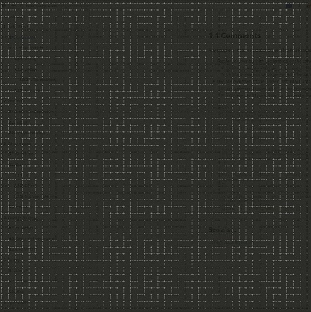
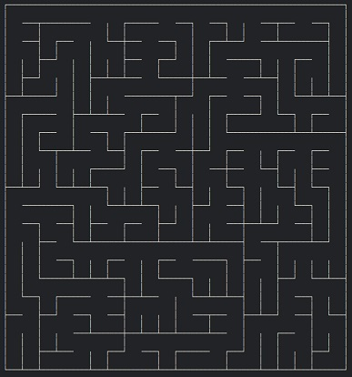

# mazes

Fun with the  programming language - maze generation, path finding and visualisation with [SDL](https://www.libsdl.org/).

[](https://travis-ci.org/enerqi/mazes)
[](https://ci.appveyor.com/project/enerqi/mazes)
[](https://coveralls.io/github/enerqi/mazes?branch=master)
[](https://github.com/enerqi/mazes/blob/master/LICENSE-APACHE)
[](https://github.com/enerqi/mazes/blob/master/LICENSE-MIT)





## Try It!

Use the mazes driver executable to try out the mazes library. The commandline interface is built with [docopt](http://docopt.org/).

```bash
cargo run -- --help

# Examples
cargo run -- render sidewinder image --grid-size=100
cargo run -- render binary image --image-out="maze.bmp" --grid-size=200
```

## Doc Links

**Rust Core**: [Rust api docs](https://doc.rust-lang.org/std/). [Rust By Example](http://rustbyexample.com/).

**SDL2**: [Rust sdl2](https://angrylawyer.github.io/rust-sdl2/sdl2/) + [Repository](https://github.com/AngryLawyer/rust-sdl2), [Rust sdl2-image src](https://github.com/xsleonard/rust-sdl2_image/blob/master/src/sdl2_image/).

**Other Rust Libs**: [docopt](http://burntsushi.net/rustdoc/docopt/), [fnv](https://doc.servo.org/fnv/), [itertools](https://bluss.github.io/rust-itertools/doc/itertools/index.html), [num](https://rust-num.github.io/num/num/index.html), [petgraph](https://bluss.github.io/petulant-avenger-graphlibrary/doc/petgraph/index.html), [rand](https://doc.rust-lang.org/rand/rand/index.html), [smallvec](http://doc.servo.org/smallvec/index.html), [walkdir](http://burntsushi.net/rustdoc/walkdir/).
